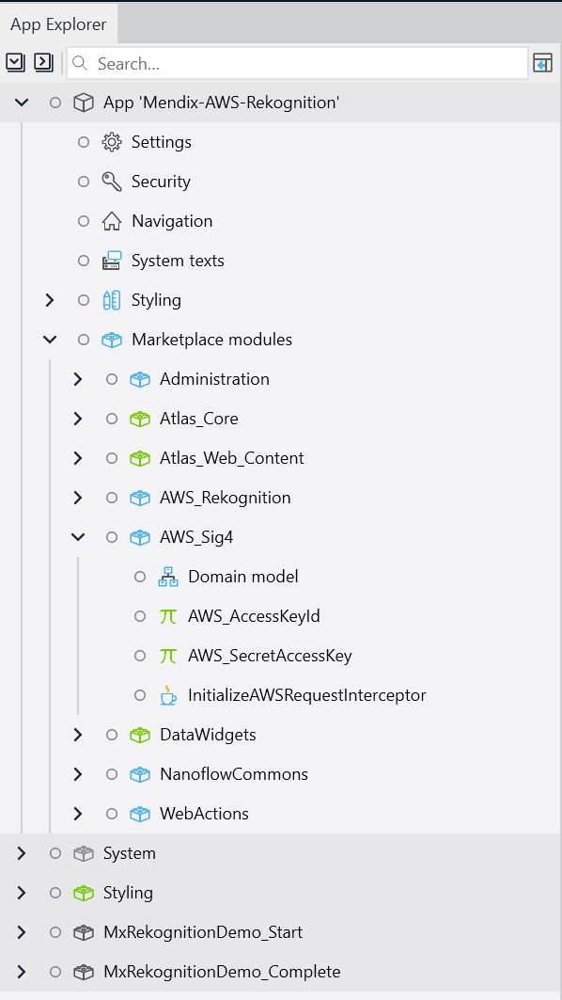

# Mendix AWS Rekoginition Template
Welcome to the Mendix AWS Rekognition template. This template has been designed to help you get started with using Mendix and AWS Rekognition. It contains all the required modules to make it easy for you to build an app connected to AWS Rekognition. Once built the app will allow you to take a photo on your mobile phone or laptop, upload it to AWS Rekognition, and view the results of the Rekognition analysis. The template contains a start and complete module so that you can either decide to use the final solution or build your way up to the solution.

<b>This template already assumes that you have some knowledge of AWS and have setup a AWS Rekognition AI model.</b>

## Setup
In order to connect to AWS Rekognition it's important that you setup a number of constants. These constants are environment variables needed to make sure that the app can connect to the right AWS service using your AWS credentials.

### Setting your AWS Access and Secret Keys
In order to authenticate with AWS services it's important that requests are signed using an AWS access and secret key. In Mendix this is done using the Sig4 process. Inside this application we have already included a module to help with this process.
1. Create a access and secret key pair on AWS with access to Rekognition service
2. Copy each of the keys
3. With the application open inside Studio Pro expand the Marketplace modules folder item in the app explorer.
4. Then expand the AWS_Sig4 module.
5. Finally double click on the Access Key ID and Secret Key then paste the values into each.

### Setting up the Rekognition constants
The Rekognition module has two constants that need to be set to ensure that the APIs can communicate with the pre-built rekognition model. These are:
1. AWS_HostPattern - This should be the url of the endpoint that the api is calling, this will be different depending on the AWS region used for rekognition. The endpoint URLs can be found here: https://docs.aws.amazon.com/general/latest/gr/rekognition.html
2. AWS_Region - This should be set to the region of where the rekognition AI model is deployed. The regions can be found here: https://docs.aws.amazon.com/general/latest/gr/rekognition.html

These constants can be found inside the AWS_Rekognition module in the marketplace folder. Then open up the constants folder:

Once you have these constants setup your ready to begin your build.

## The Build
